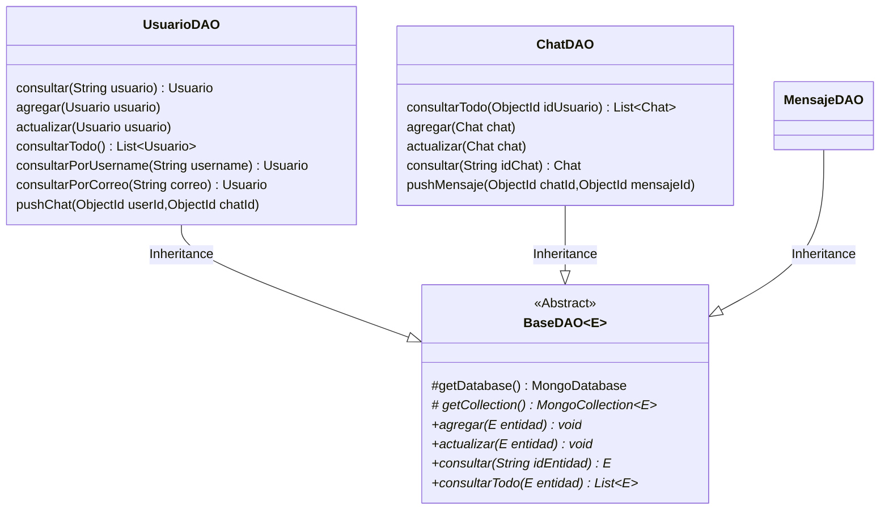

# org.itson.dao

```mermaid
classDiagram

UsuarioDAO --|> BaseDAO~E~ : Inheritance
ChatDAO --|> BaseDAO~E~ : Inheritance
MensajeDAO --|> BaseDAO~E~ : Inheritance


class BaseDAO~E~{
    <<Abstract>>
    #getDatabase() MongoDatabase
    # getCollection()* MongoCollection~E~  
    +agregar(E entidad)* void
    +actualizar(E entidad)* void
    +consultar(String idEntidad)* E
    +consultarTodo(E entidad)* List~E~
}

class UsuarioDAO{
    consultar(String usuario) Usuario
    agregar(Usuario usuario)
    actualizar(Usuario usuario)
    consultarTodo() List~Usuario~
    consultarPorUsername(String username) Usuario
    consultarPorCorreo(String correo) Usuario
    pushChat(ObjectId userId,ObjectId chatId)
}

class ChatDAO{
    consultarTodo(ObjectId idUsuario) List~Chat~
    agregar(Chat chat)
    actualizar(Chat chat)
    consultar(String idChat) Chat
    pushMensaje(ObjectId chatId,ObjectId mensajeId)
}

```

