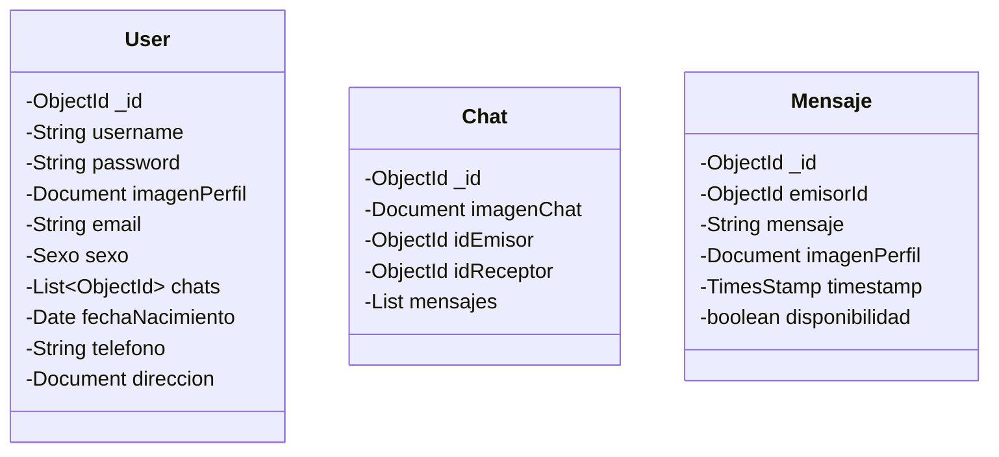

```mermaid
classDiagram

class User{
    -ObjectId _id
    -String username
    -String password
    -Document imagenPerfil
    -String email
    -Sexo sexo
    -List~ObjectId~ chats
    -Date fechaNacimiento
    -String telefono
    -Document direccion    
}

class Chat{
    -ObjectId _id
    -Document imagenChat
    -ObjectId idEmisor
    -ObjectId idReceptor
    -List<ObjectId> mensajes
}

class Mensaje{
    -ObjectId _id   
    -ObjectId emisorId
    -String mensaje
    -Document imagenPerfil 
    -TimesStamp timestamp
    -boolean disponibilidad
}
```