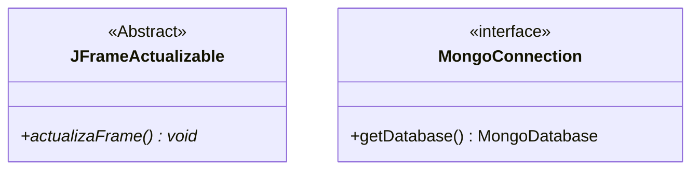

# org.itson.interfaces

```mermaid
classDiagram

class JFrameActualizable{
    <<Abstract>>
    +actualizaFrame()* void
}

class MongoConnection{
    <<interface>>
    +getDatabase() MongoDatabase
}
```