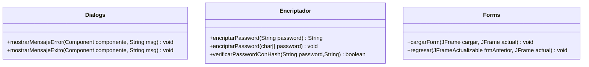
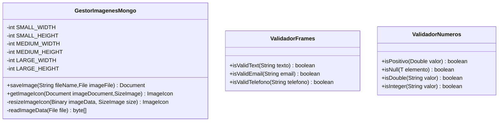

# org.itson.utils

```mermaid
classDiagram

class Dialogs{
    +mostrarMensajeError(Component componente, String msg) void
    +mostrarMensajeExito(Component componente, String msg) void 
}

class Encriptador{
    +encriptarPassword(String password) String 
    +encriptarPassword(char[] password) void 
    +verificarPasswordConHash(String password,String) boolean
}
class Forms{
    +cargarForm (JFrame cargar, JFrame actual) void
    +regresar(JFrameActualizable frmAnterior, JFrame actual) void
}
```

```mermaid
classDiagram

class GestorImagenesMongo{
    -int SMALL_WIDTH
    -int SMALL_HEIGHT
    -int MEDIUM_WIDTH
    -int MEDIUM_HEIGHT
    -int LARGE_WIDTH
    -int LARGE_HEIGHT

    +saveImage(String fileName,File imageFile) Document
    +getImageIcon(Document imageDocument,SizeImage) ImageIcon
    -resizeImageIcon(Binary imageData, SizeImage size)  ImageIcon
    -readImageData(File file) byte[]

}

class ValidadorFrames{
    +isValidText(String texto) boolean
    +isValidEmail(String email) boolean
    +isValidTelefono(String telefono) boolean
}
class ValidadorNumeros{
    +isPositivo(Double valor) boolean
    +isNull(T elemento)  boolean
    +isDouble(String valor) boolean
    +isInteger(String valor) boolean
}
```